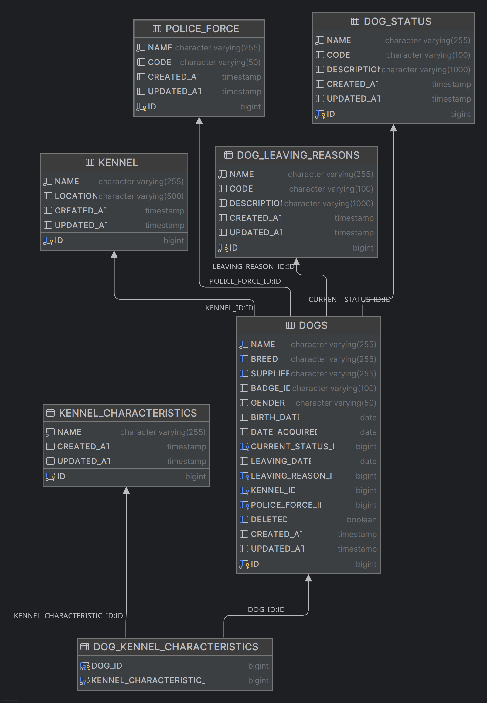

### Police Force Dogs API Task - by Miles Davenport

##### Development log

+ create application configuration.properties and pom.xml allowing for a h2 database be used
+ Create table schemas for the following tables:
+ * police_force
* * dogs
* * kennel_characteristics
* * dog_status
* * dog_leaving_reasons
* * kennel

+ dog_kennel_characteristics join table - this joins the dogs table to the kennel_characteristics table allowing for multiple characteristics to be assigned to a single dog.  A TIMESTAMP is added to show when a characteristic was assigned to a dog.  This allows for auditing of changes.
+  + There should be a join table with a dog_id and status_id

I'm added CREATED_AT and UPDATED_AT fields to all tables to allow for auditing of changes.

Create sample data for the police_force, kennel_characteristics, dog_status, dog_leaving_reasons and kennel tables.
I've created a scripts/init-db.sh script to create the database and load the sample data.  I've included an h2 jar in the lib folder - using version 3.2.232.  This saves any ambiguity with the h2 api.

I have created a join table for kennel_characteristics and dogs, allowing for multiple characteristics to be assigned to a single dog.  I have added a TIMESTAMP to show when a characteristic was assigned to a dog.
I need to think about dog status as a dog will move through a number of statuses during its lifetime:
  
  A join table with a dog_id, status_id, and date of status change will allow for this history to be tracked.  The current implementation will now allow for this audit.

Implement basic controller, service, and repository for just the dogs table.  Use @MicronautTest for test driven development.

Implement a basic MapStruct mapper to dto and entity objects - There may be a better way to do this, as i'm new to Mapstruct.

Implement filter for the dog list endpoint - this uses a JPA to search for dogs by name, breed, and status.

Implement paging (have a page offset for more than 1 result) - this is a weak implementation as it doesn't use database pagination.

Swagger - http://localhost:8080/swagger-ui/index.html?url=/swagger/openapi.yml - is not working.


##### Database schema:



##### Code Structure

I have used a controller -> service -> repository (JPA / Crud) for the implementation.  

I have modelled relationships using JPA annotations (ManyToOne, OneToMany, JoinTable).  I have used MapStruct to map between entity and dto objects.
The Mapstruct implementation may be lacking.

I have never used Micronaut professionally.  I am borrowing from my experience of using Spring Boot.

##### Testing

1.  I am using @MicronautTest to test from a request to the controller.
I am injecting repository(s) and I am preloading with data.
2.  I am using Mockito to mock the service layer and test the HTTP and Exception response from the controller.

3.  I am testing the paging in PagTest.java

4.  I am testing the DogStat and LeavingReason validators in ValidDogStatusValidatorTest.java and ValidLeavingReasonValidatorTest.java


##### Assumptions

I'm using an API path of /api/dogs (not /api/dogs/dogs) as in the specification.

##### Critique

The paging functionality is not best - it does not use database pagination.

The controller is focussed on the dogs table.  I have not implemented any controller for other tables (functionality).

Some of the code could be more modular.  There is some duplication in tests.


##### Installation (assume Java 25 and Apache Maven 4.0.0-rc-2 - OSX - using sdk)

```
$ rm -f target/police-force-dogs* && \
java -cp lib/h2-2.3.232.jar org.h2.tools.Shell \
-url "jdbc:h2:file:./target/police-force-dogs;DB_CLOSE_DELAY=-1;DB_CLOSE_ON_EXIT=FALSE" \
-user sa \
-sql "RUNSCRIPT FROM 'src/main/resources/schema.sql'; RUNSCRIPT FROM 'src/main/resources/data.sql'; SELECT COUNT(*) AS police_force_count FROM police_force; SELECT COUNT(*) AS dogs_count FROM dogs;"

(Update count: 19, 34 ms)
(Update count: 8, 5 ms)
POLICE_FORCE_COUNT
1
(1 row, 5 ms)
DOGS_COUNT
1
(1 row, 0 ms)
```

Running tests:

```
$ mvn test
WARNING: A terminally deprecated method in sun.misc.Unsafe has been called
WARNING: sun.misc.Unsafe::objectFieldOffset has been called by com.google.common.util.concurrent.AbstractFuture$UnsafeAtomicHelper (file:/opt/maven/apache-maven-4.0.0-rc-2/lib/guava-33.3.1-jre.jar)
WARNING: Please consider reporting this to the maintainers of class com.google.common.util.concurrent.AbstractFuture$UnsafeAtomicHelper
WARNING: sun.misc.Unsafe::objectFieldOffset will be removed in a future release
[INFO] Scanning for projects...
[WARNING] 
[WARNING] Some problems were encountered while building the effective model for 'com.chocksaway:policeforcedogs:jar:0.1'
[WARNING] Ignored POM import for: io.opentelemetry:opentelemetry-common:jar:1.61.0@compile as already imported io.opentelemetry:opentelemetry-common:jar:1.62.0@compile. Add the conflicting managed dependency directly to the dependencyManagement section of the POM. @ io.micronaut.tracing:micronaut-tracing-bom:8.0.0
[WARNING] Ignored POM import for: io.opentelemetry:opentelemetry-context:jar:1.61.0@compile as already imported io.opentelemetry:opentelemetry-context:jar:1.62.0@compile. Add the conflicting managed dependency directly to the dependencyManagement section of the POM. @ io.micronaut.tracing:micronaut-tracing-bom:8.0.0

[snip]

[INFO] 
[INFO] --------------------------------------------< com.chocksaway:policeforcedogs >--------------------------------------------
[INFO] Building policeforcedogs 0.1
[INFO]   from pom.xml
[INFO] ---------------------------------------------------------[ jar ]----------------------------------------------------------
[WARNING] 2 problems were encountered while building the effective model for io.micronaut.reactor:micronaut-reactor:jar:4.0.0 during dependency collection step for project (use -X to see details)
[INFO] 
[INFO] --- mn:5.0.0:generate-import-factory (default-generate-import-factory) @ policeforcedogs ---
[INFO] 
[INFO] --- mn:5.0.0:generate-openapi-generic (default-generate-openapi-generic) @ policeforcedogs ---
[INFO] 
[INFO] --- mn:5.0.0:generate-openapi-client (default-generate-openapi-client) @ policeforcedogs ---
[INFO] 
[INFO] --- mn:5.0.0:generate-openapi-server (default-generate-openapi-server) @ policeforcedogs ---
[INFO] 
[INFO] --- mn:5.0.0:generate-jsonschema (default-generate-jsonschema) @ policeforcedogs ---
[INFO] 
[INFO] --- resources:3.5.0:resources (default-resources) @ policeforcedogs ---
[INFO] Copying 5 resources from src/main/resources to target/classes
[INFO] skip non existing resourceDirectory /home/milesd-9510/workspace/micronaut/PoliceForceDogs/src/main/resources-filtered
[INFO] 
[INFO] --- compiler:3.15.0:compile (default-compile) @ policeforcedogs ---
[INFO] Nothing to compile - all classes are up to date.
[INFO] 
[INFO] --- resources:3.5.0:testResources (default-testResources) @ policeforcedogs ---
[INFO] Copying 1 resource from src/test/resources to target/test-classes
[INFO] skip non existing resourceDirectory /home/milesd-9510/workspace/micronaut/PoliceForceDogs/src/test/resources-filtered
[INFO] 
[INFO] --- compiler:3.15.0:testCompile (default-testCompile) @ policeforcedogs ---
[INFO] Nothing to compile - all classes are up to date.
[INFO] 
[INFO] --- mn:5.0.0:start-testresources-service (default-start-testresources-service) @ policeforcedogs ---
[INFO] 
[INFO] --- mn:5.0.0:validate-test-configuration (default-validate-test-configuration) @ policeforcedogs ---
[INFO] 
[INFO] --- surefire:3.5.6:test (default-test) @ policeforcedogs ---
[INFO] Using auto detected provider org.apache.maven.surefire.junitplatform.JUnitPlatformProvider
[INFO] 
[INFO] -------------------------------------------------------
[INFO]  T E S T S
[INFO] -------------------------------------------------------
[INFO] Running com.chocksaway.service.DogServiceSoftDeleteFilterTest
[WARNING] [stderr] Mockito is currently self-attaching to enable the inline-mock-maker. This will no longer work in future releases of the JDK. Please add Mockito as an agent to your build as described in Mockito's documentation: https://javadoc.io/doc/org.mockito/mockito-core/latest/org.mockito/org/mockito/Mockito.html#0.3
[WARNING] [stderr] OpenJDK 64-Bit Server VM warning: Sharing is only supported for boot loader classes because bootstrap classpath has been appended
[WARNING] [stderr] WARNING: A Java agent has been loaded dynamically (/home/milesd-9510/.m2/repository/net/bytebuddy/byte-buddy-agent/1.18.7/byte-buddy-agent-1.18.7.jar)
[WARNING] [stderr] WARNING: If a serviceability tool is in use, please run with -XX:+EnableDynamicAgentLoading to hide this warning
[WARNING] [stderr] WARNING: If a serviceability tool is not in use, please run with -Djdk.instrument.traceUsage for more information
[WARNING] [stderr] WARNING: Dynamic loading of agents will be disallowed by default in a future release
[INFO] Tests run: 1, Failures: 0, Errors: 0, Skipped: 0, Time elapsed: 0.664 s -- in com.chocksaway.service.DogServiceSoftDeleteFilterTest
[INFO] Running com.chocksaway.service.DogServiceFilterTest
[INFO] Tests run: 2, Failures: 0, Errors: 0, Skipped: 0, Time elapsed: 0.024 s -- in com.chocksaway.service.DogServiceFilterTest
[INFO] Running com.chocksaway.service.DogServiceUpdateTest
[INFO] Tests run: 2, Failures: 0, Errors: 0, Skipped: 0, Time elapsed: 0.024 s -- in com.chocksaway.service.DogServiceUpdateTest
[INFO] Running com.chocksaway.service.DogServiceDeleteTest
[INFO] Tests run: 2, Failures: 0, Errors: 0, Skipped: 0, Time elapsed: 0.007 s -- in com.chocksaway.service.DogServiceDeleteTest
[INFO] Running com.chocksaway.validation.ValidDogStatusValidatorTest
[INFO] Tests run: 4, Failures: 0, Errors: 0, Skipped: 0, Time elapsed: 0.045 s -- in com.chocksaway.validation.ValidDogStatusValidatorTest
[INFO] Running com.chocksaway.validation.ValidLeavingReasonValidatorTest
[INFO] Tests run: 4, Failures: 0, Errors: 0, Skipped: 0, Time elapsed: 0.038 s -- in com.chocksaway.validation.ValidLeavingReasonValidatorTest
[INFO] Running com.chocksaway.util.PageTest
[INFO] Tests run: 7, Failures: 0, Errors: 0, Skipped: 0, Time elapsed: 0.008 s -- in com.chocksaway.util.PageTest
[INFO] Running com.chocksaway.controller.DogGetTest
[INFO] [stdout] 13:47:48.612 [main] INFO  i.m.context.env.DefaultEnvironment - Established active environments: [test]
[INFO] [stdout] 13:47:48.768 [main] INFO  o.h.validator.internal.util.Version - HV000001: Hibernate Validator 9.1.0.Final
[INFO] [stdout] 13:47:48.887 [main] INFO  org.hibernate.orm.core - HHH000001: Hibernate ORM core version 7.3.4.Final
[INFO] [stdout] 13:47:48.909 [main] INFO  com.zaxxer.hikari.HikariDataSource - HikariPool-1 - Starting...
[INFO] [stdout] 13:47:49.043 [main] INFO  com.zaxxer.hikari.pool.HikariPool - HikariPool-1 - Added connection conn0: url=jdbc:h2:mem:police-force-dogs user=SA
[INFO] [stdout] 13:47:49.044 [main] INFO  com.zaxxer.hikari.HikariDataSource - HikariPool-1 - Start completed.
[INFO] [stdout] 13:47:49.229 [main] INFO  o.hibernate.orm.connections.pooling - HHH10001005: Database info:
[INFO] [stdout]         Database JDBC URL [jdbc:h2:mem:police-force-dogs]
[INFO] [stdout]         Database driver: H2 JDBC Driver
[INFO] [stdout]         Database dialect: H2Dialect
[INFO] [stdout]         Database version: 2.4.240
[INFO] [stdout]         Default catalog/schema: POLICE-FORCE-DOGS/PUBLIC
[INFO] [stdout]         Autocommit mode: undefined/unknown
[INFO] [stdout]         Isolation level: READ_COMMITTED [default READ_COMMITTED]
[INFO] [stdout]         JDBC fetch size: 100
[INFO] [stdout]         Pool: DataSourceConnectionProvider
[INFO] [stdout]         Minimum pool size: undefined/unknown
[INFO] [stdout]         Maximum pool size: undefined/unknown
[INFO] [stdout] Hibernate: drop table if exists dog_kennel_characteristics cascade 
[INFO] [stdout] Hibernate: drop table if exists dog_leaving_reasons cascade 
[INFO] [stdout] Hibernate: drop table if exists dog_status cascade 
[INFO] [stdout] Hibernate: drop table if exists dogs cascade 
[INFO] [stdout] Hibernate: drop table if exists kennel cascade 
[INFO] [stdout] Hibernate: drop table if exists kennel_characteristics cascade 
[INFO] [stdout] Hibernate: drop table if exists police_force cascade 
[INFO] [stdout] Hibernate: create table dog_kennel_characteristics (dog_id bigint not null, kennel_characteristic_id bigint not null, primary key (dog_id, kennel_characteristic_id))
[INFO] [stdout] Hibernate: create table dog_leaving_reasons (created_at timestamp(6), id bigint generated by default as identity, updated_at timestamp(6), code varchar(255), description varchar(255), name varchar(255) not null, primary key (id))
[INFO] [stdout] Hibernate: create table dog_status (created_at timestamp(6), id bigint generated by default as identity, updated_at timestamp(6), code varchar(255), description varchar(255), name varchar(255) not null, primary key (id))
[INFO] [stdout] Hibernate: create table dogs (birth_date date, date_acquired date, deleted boolean not null, leaving_date date, created_at timestamp(6), current_status_id bigint, id bigint generated by default as identity, kennel_id bigint, leaving_reason_id bigint, police_force_id bigint, updated_at timestamp(6), badge_id varchar(255) not null unique, breed varchar(255) not null, gender varchar(255) not null, name varchar(255) not null, supplier varchar(255) not null, primary key (id))
[INFO] [stdout] Hibernate: create table kennel (created_at timestamp(6), id bigint generated by default as identity, updated_at timestamp(6), location varchar(255), name varchar(255) not null, primary key (id))
[INFO] [stdout] Hibernate: create table kennel_characteristics (created_at timestamp(6), id bigint generated by default as identity, updated_at timestamp(6), name varchar(255) not null, primary key (id))
[INFO] [stdout] Hibernate: create table police_force (created_at timestamp(6), id bigint generated by default as identity, updated_at timestamp(6), code varchar(255), name varchar(255) not null, primary key (id))
[INFO] [stdout] Hibernate: alter table if exists dog_kennel_characteristics add constraint FKeupmnk9qjeg99a0aj0ywpjcel foreign key (kennel_characteristic_id) references kennel_characteristics
[INFO] [stdout] Hibernate: alter table if exists dog_kennel_characteristics add constraint FK2cumygpwxf2rullr5my3rvvfd foreign key (dog_id) references dogs
[INFO] [stdout] Hibernate: alter table if exists dogs add constraint FKrwvtk42tlioai622r5pukqrqy foreign key (current_status_id) references dog_status
[INFO] [stdout] Hibernate: alter table if exists dogs add constraint FK36kjo2rhn9dqyemx6b3k8ox6f foreign key (kennel_id) references kennel
[INFO] [stdout] Hibernate: alter table if exists dogs add constraint FK9jxblctoc94pfk1kjmcaso3gp foreign key (leaving_reason_id) references dog_leaving_reasons
[INFO] [stdout] Hibernate: alter table if exists dogs add constraint FK2ko2o5trsn4x4od3e8cfn2sic foreign key (police_force_id) references police_force
[INFO] [stdout] Hibernate: insert into police_force (code,created_at,name,updated_at,id) values (?,?,?,?,default)
[INFO] [stdout] Hibernate: insert into kennel (created_at,location,name,updated_at,id) values (?,?,?,?,default)
[INFO] [stdout] Hibernate: insert into dog_status (code,created_at,description,name,updated_at,id) values (?,?,?,?,?,default)
[INFO] [stdout] Hibernate: select ds1_0.id,ds1_0.code,ds1_0.created_at,ds1_0.description,ds1_0.name,ds1_0.updated_at from dog_status ds1_0 where (ds1_0.id=?) fetch first ? rows only
[INFO] [stdout] Hibernate: select ds1_0.id,ds1_0.code,ds1_0.created_at,ds1_0.description,ds1_0.name,ds1_0.updated_at from dog_status ds1_0 where ds1_0.id=?
[INFO] [stdout] Hibernate: select k1_0.id,k1_0.created_at,k1_0.location,k1_0.name,k1_0.updated_at from kennel k1_0 where k1_0.id=?
[INFO] [stdout] Hibernate: select pf1_0.id,pf1_0.code,pf1_0.created_at,pf1_0.name,pf1_0.updated_at from police_force pf1_0 where pf1_0.id=?
[INFO] [stdout] Hibernate: insert into dogs (badge_id,birth_date,breed,created_at,current_status_id,date_acquired,deleted,gender,kennel_id,leaving_date,leaving_reason_id,name,police_force_id,supplier,updated_at,id) values (?,?,?,?,?,?,?,?,?,?,?,?,?,?,?,default)
[INFO] [stdout] Hibernate: select ds1_0.id,ds1_0.code,ds1_0.created_at,ds1_0.description,ds1_0.name,ds1_0.updated_at from dog_status ds1_0 where (ds1_0.id=?) fetch first ? rows only
[INFO] [stdout] Hibernate: select ds1_0.id,ds1_0.code,ds1_0.created_at,ds1_0.description,ds1_0.name,ds1_0.updated_at from dog_status ds1_0 where ds1_0.id=?
[INFO] [stdout] Hibernate: select k1_0.id,k1_0.created_at,k1_0.location,k1_0.name,k1_0.updated_at from kennel k1_0 where k1_0.id=?
[INFO] [stdout] Hibernate: select pf1_0.id,pf1_0.code,pf1_0.created_at,pf1_0.name,pf1_0.updated_at from police_force pf1_0 where pf1_0.id=?
[INFO] [stdout] Hibernate: insert into dogs (badge_id,birth_date,breed,created_at,current_status_id,date_acquired,deleted,gender,kennel_id,leaving_date,leaving_reason_id,name,police_force_id,supplier,updated_at,id) values (?,?,?,?,?,?,?,?,?,?,?,?,?,?,?,default)
[INFO] [stdout] Hibernate: select d1_0.id,d1_0.badge_id,d1_0.birth_date,d1_0.breed,d1_0.created_at,d1_0.current_status_id,d1_0.date_acquired,d1_0.deleted,d1_0.gender,d1_0.kennel_id,d1_0.leaving_date,d1_0.leaving_reason_id,d1_0.name,d1_0.police_force_id,d1_0.supplier,d1_0.updated_at from dogs d1_0 where d1_0.deleted=false and (lower(d1_0.name) like lower(('%'||?||'%')) escape '' or lower(d1_0.breed) like lower(('%'||?||'%')) escape '' or lower(d1_0.supplier) like lower(('%'||?||'%')) escape '')
[INFO] [stdout] Hibernate: select kc1_0.dog_id,kc1_1.id,kc1_1.created_at,kc1_1.name,kc1_1.updated_at from dog_kennel_characteristics kc1_0 join kennel_characteristics kc1_1 on kc1_1.id=kc1_0.kennel_characteristic_id where kc1_0.dog_id=?
[INFO] [stdout] Hibernate: insert into police_force (code,created_at,name,updated_at,id) values (?,?,?,?,default)
[INFO] [stdout] Hibernate: insert into kennel (created_at,location,name,updated_at,id) values (?,?,?,?,default)
[INFO] [stdout] Hibernate: insert into dog_status (code,created_at,description,name,updated_at,id) values (?,?,?,?,?,default)
[INFO] [stdout] Hibernate: select ds1_0.id,ds1_0.code,ds1_0.created_at,ds1_0.description,ds1_0.name,ds1_0.updated_at from dog_status ds1_0 where (ds1_0.id=?) fetch first ? rows only
[INFO] [stdout] Hibernate: select ds1_0.id,ds1_0.code,ds1_0.created_at,ds1_0.description,ds1_0.name,ds1_0.updated_at from dog_status ds1_0 where ds1_0.id=?
[INFO] [stdout] Hibernate: select k1_0.id,k1_0.created_at,k1_0.location,k1_0.name,k1_0.updated_at from kennel k1_0 where k1_0.id=?
[INFO] [stdout] Hibernate: select pf1_0.id,pf1_0.code,pf1_0.created_at,pf1_0.name,pf1_0.updated_at from police_force pf1_0 where pf1_0.id=?
[INFO] [stdout] Hibernate: insert into dogs (badge_id,birth_date,breed,created_at,current_status_id,date_acquired,deleted,gender,kennel_id,leaving_date,leaving_reason_id,name,police_force_id,supplier,updated_at,id) values (?,?,?,?,?,?,?,?,?,?,?,?,?,?,?,default)
[INFO] [stdout] Hibernate: select ds1_0.id,ds1_0.code,ds1_0.created_at,ds1_0.description,ds1_0.name,ds1_0.updated_at from dog_status ds1_0 where (ds1_0.id=?) fetch first ? rows only
[INFO] [stdout] Hibernate: select ds1_0.id,ds1_0.code,ds1_0.created_at,ds1_0.description,ds1_0.name,ds1_0.updated_at from dog_status ds1_0 where ds1_0.id=?
[INFO] [stdout] Hibernate: select k1_0.id,k1_0.created_at,k1_0.location,k1_0.name,k1_0.updated_at from kennel k1_0 where k1_0.id=?
[INFO] [stdout] Hibernate: select pf1_0.id,pf1_0.code,pf1_0.created_at,pf1_0.name,pf1_0.updated_at from police_force pf1_0 where pf1_0.id=?
[INFO] [stdout] Hibernate: insert into dogs (badge_id,birth_date,breed,created_at,current_status_id,date_acquired,deleted,gender,kennel_id,leaving_date,leaving_reason_id,name,police_force_id,supplier,updated_at,id) values (?,?,?,?,?,?,?,?,?,?,?,?,?,?,?,default)
[INFO] [stdout] Hibernate: select d1_0.id,d1_0.badge_id,d1_0.birth_date,d1_0.breed,d1_0.created_at,d1_0.current_status_id,d1_0.date_acquired,d1_0.deleted,d1_0.gender,d1_0.kennel_id,d1_0.leaving_date,d1_0.leaving_reason_id,d1_0.name,d1_0.police_force_id,d1_0.supplier,d1_0.updated_at from dogs d1_0 where d1_0.deleted=false
[INFO] [stdout] Hibernate: drop table if exists dog_kennel_characteristics cascade 
[INFO] [stdout] Hibernate: drop table if exists dog_leaving_reasons cascade 
[INFO] [stdout] Hibernate: drop table if exists dog_status cascade 
[INFO] [stdout] Hibernate: drop table if exists dogs cascade 
[INFO] [stdout] Hibernate: drop table if exists kennel cascade 
[INFO] [stdout] Hibernate: drop table if exists kennel_characteristics cascade 
[INFO] [stdout] Hibernate: drop table if exists police_force cascade 
[INFO] [stdout] 13:47:51.232 [main] INFO  com.zaxxer.hikari.HikariDataSource - HikariPool-1 - Shutdown initiated...
[INFO] [stdout] 13:47:51.234 [main] INFO  com.zaxxer.hikari.HikariDataSource - HikariPool-1 - Shutdown completed.
[INFO] Tests run: 2, Failures: 0, Errors: 0, Skipped: 0, Time elapsed: 2.853 s -- in com.chocksaway.controller.DogGetTest
[INFO] Running com.chocksaway.controller.DogControllerUnitGetTest
[INFO] Tests run: 2, Failures: 0, Errors: 0, Skipped: 0, Time elapsed: 0.071 s -- in com.chocksaway.controller.DogControllerUnitGetTest
[INFO] Running com.chocksaway.controller.DogSaveTest
[INFO] [stdout] 13:47:51.323 [main] INFO  i.m.context.env.DefaultEnvironment - Established active environments: [test]
[INFO] [stdout] 13:47:51.357 [main] INFO  com.zaxxer.hikari.HikariDataSource - HikariPool-2 - Starting...
[INFO] [stdout] 13:47:51.361 [main] INFO  com.zaxxer.hikari.pool.HikariPool - HikariPool-2 - Added connection conn10: url=jdbc:h2:mem:police-force-dogs user=SA
[INFO] [stdout] 13:47:51.361 [main] INFO  com.zaxxer.hikari.HikariDataSource - HikariPool-2 - Start completed.
[INFO] [stdout] 13:47:51.377 [main] INFO  o.hibernate.orm.connections.pooling - HHH10001005: Database info:
[INFO] [stdout]         Database JDBC URL [jdbc:h2:mem:police-force-dogs]
[INFO] [stdout]         Database driver: H2 JDBC Driver
[INFO] [stdout]         Database dialect: H2Dialect
[INFO] [stdout]         Database version: 2.4.240
[INFO] [stdout]         Default catalog/schema: POLICE-FORCE-DOGS/PUBLIC
[INFO] [stdout]         Autocommit mode: undefined/unknown
[INFO] [stdout]         Isolation level: READ_COMMITTED [default READ_COMMITTED]
[INFO] [stdout]         JDBC fetch size: 100
[INFO] [stdout]         Pool: DataSourceConnectionProvider
[INFO] [stdout]         Minimum pool size: undefined/unknown
[INFO] [stdout]         Maximum pool size: undefined/unknown
[INFO] [stdout] Hibernate: drop table if exists dog_kennel_characteristics cascade 
[INFO] [stdout] Hibernate: drop table if exists dog_leaving_reasons cascade 
[INFO] [stdout] Hibernate: drop table if exists dog_status cascade 
[INFO] [stdout] Hibernate: drop table if exists dogs cascade 
[INFO] [stdout] Hibernate: drop table if exists kennel cascade 
[INFO] [stdout] Hibernate: drop table if exists kennel_characteristics cascade 
[INFO] [stdout] Hibernate: drop table if exists police_force cascade 
[INFO] [stdout] Hibernate: create table dog_kennel_characteristics (dog_id bigint not null, kennel_characteristic_id bigint not null, primary key (dog_id, kennel_characteristic_id))
[INFO] [stdout] Hibernate: create table dog_leaving_reasons (created_at timestamp(6), id bigint generated by default as identity, updated_at timestamp(6), code varchar(255), description varchar(255), name varchar(255) not null, primary key (id))
[INFO] [stdout] Hibernate: create table dog_status (created_at timestamp(6), id bigint generated by default as identity, updated_at timestamp(6), code varchar(255), description varchar(255), name varchar(255) not null, primary key (id))
[INFO] [stdout] Hibernate: create table dogs (birth_date date, date_acquired date, deleted boolean not null, leaving_date date, created_at timestamp(6), current_status_id bigint, id bigint generated by default as identity, kennel_id bigint, leaving_reason_id bigint, police_force_id bigint, updated_at timestamp(6), badge_id varchar(255) not null unique, breed varchar(255) not null, gender varchar(255) not null, name varchar(255) not null, supplier varchar(255) not null, primary key (id))
[INFO] [stdout] Hibernate: create table kennel (created_at timestamp(6), id bigint generated by default as identity, updated_at timestamp(6), location varchar(255), name varchar(255) not null, primary key (id))
[INFO] [stdout] Hibernate: create table kennel_characteristics (created_at timestamp(6), id bigint generated by default as identity, updated_at timestamp(6), name varchar(255) not null, primary key (id))
[INFO] [stdout] Hibernate: create table police_force (created_at timestamp(6), id bigint generated by default as identity, updated_at timestamp(6), code varchar(255), name varchar(255) not null, primary key (id))
[INFO] [stdout] Hibernate: alter table if exists dog_kennel_characteristics add constraint FKeupmnk9qjeg99a0aj0ywpjcel foreign key (kennel_characteristic_id) references kennel_characteristics
[INFO] [stdout] Hibernate: alter table if exists dog_kennel_characteristics add constraint FK2cumygpwxf2rullr5my3rvvfd foreign key (dog_id) references dogs
[INFO] [stdout] Hibernate: alter table if exists dogs add constraint FKrwvtk42tlioai622r5pukqrqy foreign key (current_status_id) references dog_status
[INFO] [stdout] Hibernate: alter table if exists dogs add constraint FK36kjo2rhn9dqyemx6b3k8ox6f foreign key (kennel_id) references kennel
[INFO] [stdout] Hibernate: alter table if exists dogs add constraint FK9jxblctoc94pfk1kjmcaso3gp foreign key (leaving_reason_id) references dog_leaving_reasons
[INFO] [stdout] Hibernate: alter table if exists dogs add constraint FK2ko2o5trsn4x4od3e8cfn2sic foreign key (police_force_id) references police_force
[INFO] [stdout] Hibernate: select ds1_0.id,ds1_0.code,ds1_0.created_at,ds1_0.description,ds1_0.name,ds1_0.updated_at from dog_status ds1_0 where (ds1_0.id=?) fetch first ? rows only
[INFO] [stdout] Hibernate: select ds1_0.id,ds1_0.code,ds1_0.created_at,ds1_0.description,ds1_0.name,ds1_0.updated_at from dog_status ds1_0 where (ds1_0.id=?) fetch first ? rows only
[INFO] [stdout] Hibernate: select ds1_0.id,ds1_0.code,ds1_0.created_at,ds1_0.description,ds1_0.name,ds1_0.updated_at from dog_status ds1_0 where ds1_0.id=?
[INFO] [stdout] Hibernate: select k1_0.id,k1_0.created_at,k1_0.location,k1_0.name,k1_0.updated_at from kennel k1_0 where k1_0.id=?
[INFO] [stdout] Hibernate: select pf1_0.id,pf1_0.code,pf1_0.created_at,pf1_0.name,pf1_0.updated_at from police_force pf1_0 where pf1_0.id=?
[INFO] [stdout] Hibernate: select kc1_0.id,kc1_0.created_at,kc1_0.name,kc1_0.updated_at from kennel_characteristics kc1_0 where kc1_0.id=?
[INFO] [stdout] Hibernate: select kc1_0.id,kc1_0.created_at,kc1_0.name,kc1_0.updated_at from kennel_characteristics kc1_0 where kc1_0.id=?
[INFO] [stdout] Hibernate: insert into dogs (badge_id,birth_date,breed,created_at,current_status_id,date_acquired,deleted,gender,kennel_id,leaving_date,leaving_reason_id,name,police_force_id,supplier,updated_at,id) values (?,?,?,?,?,?,?,?,?,?,?,?,?,?,?,default)
[INFO] [stdout] Hibernate: insert into dog_kennel_characteristics (dog_id,kennel_characteristic_id) values (?,?)
[INFO] [stdout] Hibernate: insert into dog_kennel_characteristics (dog_id,kennel_characteristic_id) values (?,?)
[INFO] [stdout] Hibernate: drop table if exists dog_kennel_characteristics cascade 
[INFO] [stdout] Hibernate: drop table if exists dog_leaving_reasons cascade 
[INFO] [stdout] Hibernate: drop table if exists dog_status cascade 
[INFO] [stdout] Hibernate: drop table if exists dogs cascade 
[INFO] [stdout] Hibernate: drop table if exists kennel cascade 
[INFO] [stdout] Hibernate: drop table if exists kennel_characteristics cascade 
[INFO] [stdout] Hibernate: drop table if exists police_force cascade 
[INFO] [stdout] 13:47:51.650 [main] INFO  com.zaxxer.hikari.HikariDataSource - HikariPool-2 - Shutdown initiated...
[INFO] [stdout] 13:47:51.678 [main] INFO  com.zaxxer.hikari.HikariDataSource - HikariPool-2 - Shutdown completed.
[INFO] Tests run: 2, Failures: 0, Errors: 0, Skipped: 0, Time elapsed: 0.368 s -- in com.chocksaway.controller.DogSaveTest
[INFO] Running com.chocksaway.controller.DogUpdateTest
[INFO] [stdout] 13:47:51.693 [main] INFO  i.m.context.env.DefaultEnvironment - Established active environments: [test]
[INFO] [stdout] 13:47:51.722 [main] INFO  com.zaxxer.hikari.HikariDataSource - HikariPool-3 - Starting...
[INFO] [stdout] 13:47:51.725 [main] INFO  com.zaxxer.hikari.pool.HikariPool - HikariPool-3 - Added connection conn18: url=jdbc:h2:mem:police-force-dogs user=SA
[INFO] [stdout] 13:47:51.725 [main] INFO  com.zaxxer.hikari.HikariDataSource - HikariPool-3 - Start completed.
[INFO] [stdout] 13:47:51.734 [main] INFO  o.hibernate.orm.connections.pooling - HHH10001005: Database info:
[INFO] [stdout]         Database JDBC URL [jdbc:h2:mem:police-force-dogs]
[INFO] [stdout]         Database driver: H2 JDBC Driver
[INFO] [stdout]         Database dialect: H2Dialect
[INFO] [stdout]         Database version: 2.4.240
[INFO] [stdout]         Default catalog/schema: POLICE-FORCE-DOGS/PUBLIC
[INFO] [stdout]         Autocommit mode: undefined/unknown
[INFO] [stdout]         Isolation level: READ_COMMITTED [default READ_COMMITTED]
[INFO] [stdout]         JDBC fetch size: 100
[INFO] [stdout]         Pool: DataSourceConnectionProvider
[INFO] [stdout]         Minimum pool size: undefined/unknown
[INFO] [stdout]         Maximum pool size: undefined/unknown
[INFO] [stdout] Hibernate: drop table if exists dog_kennel_characteristics cascade 
[INFO] [stdout] Hibernate: drop table if exists dog_leaving_reasons cascade 
[INFO] [stdout] Hibernate: drop table if exists dog_status cascade 
[INFO] [stdout] Hibernate: drop table if exists dogs cascade 
[INFO] [stdout] Hibernate: drop table if exists kennel cascade 
[INFO] [stdout] Hibernate: drop table if exists kennel_characteristics cascade 
[INFO] [stdout] Hibernate: drop table if exists police_force cascade 
[INFO] [stdout] Hibernate: create table dog_kennel_characteristics (dog_id bigint not null, kennel_characteristic_id bigint not null, primary key (dog_id, kennel_characteristic_id))
[INFO] [stdout] Hibernate: create table dog_leaving_reasons (created_at timestamp(6), id bigint generated by default as identity, updated_at timestamp(6), code varchar(255), description varchar(255), name varchar(255) not null, primary key (id))
[INFO] [stdout] Hibernate: create table dog_status (created_at timestamp(6), id bigint generated by default as identity, updated_at timestamp(6), code varchar(255), description varchar(255), name varchar(255) not null, primary key (id))
[INFO] [stdout] Hibernate: create table dogs (birth_date date, date_acquired date, deleted boolean not null, leaving_date date, created_at timestamp(6), current_status_id bigint, id bigint generated by default as identity, kennel_id bigint, leaving_reason_id bigint, police_force_id bigint, updated_at timestamp(6), badge_id varchar(255) not null unique, breed varchar(255) not null, gender varchar(255) not null, name varchar(255) not null, supplier varchar(255) not null, primary key (id))
[INFO] [stdout] Hibernate: create table kennel (created_at timestamp(6), id bigint generated by default as identity, updated_at timestamp(6), location varchar(255), name varchar(255) not null, primary key (id))
[INFO] [stdout] Hibernate: create table kennel_characteristics (created_at timestamp(6), id bigint generated by default as identity, updated_at timestamp(6), name varchar(255) not null, primary key (id))
[INFO] [stdout] Hibernate: create table police_force (created_at timestamp(6), id bigint generated by default as identity, updated_at timestamp(6), code varchar(255), name varchar(255) not null, primary key (id))
[INFO] [stdout] Hibernate: alter table if exists dog_kennel_characteristics add constraint FKeupmnk9qjeg99a0aj0ywpjcel foreign key (kennel_characteristic_id) references kennel_characteristics
[INFO] [stdout] Hibernate: alter table if exists dog_kennel_characteristics add constraint FK2cumygpwxf2rullr5my3rvvfd foreign key (dog_id) references dogs
[INFO] [stdout] Hibernate: alter table if exists dogs add constraint FKrwvtk42tlioai622r5pukqrqy foreign key (current_status_id) references dog_status
[INFO] [stdout] Hibernate: alter table if exists dogs add constraint FK36kjo2rhn9dqyemx6b3k8ox6f foreign key (kennel_id) references kennel
[INFO] [stdout] Hibernate: alter table if exists dogs add constraint FK9jxblctoc94pfk1kjmcaso3gp foreign key (leaving_reason_id) references dog_leaving_reasons
[INFO] [stdout] Hibernate: alter table if exists dogs add constraint FK2ko2o5trsn4x4od3e8cfn2sic foreign key (police_force_id) references police_force
[INFO] [stdout] Hibernate: select ds1_0.id,ds1_0.code,ds1_0.created_at,ds1_0.description,ds1_0.name,ds1_0.updated_at from dog_status ds1_0 where (ds1_0.id=?) fetch first ? rows only
[INFO] [stdout] Hibernate: select ds1_0.id,ds1_0.code,ds1_0.created_at,ds1_0.description,ds1_0.name,ds1_0.updated_at from dog_status ds1_0 where ds1_0.id=?
[INFO] [stdout] Hibernate: select k1_0.id,k1_0.created_at,k1_0.location,k1_0.name,k1_0.updated_at from kennel k1_0 where k1_0.id=?
[INFO] [stdout] Hibernate: select pf1_0.id,pf1_0.code,pf1_0.created_at,pf1_0.name,pf1_0.updated_at from police_force pf1_0 where pf1_0.id=?
[INFO] [stdout] Hibernate: select kc1_0.id,kc1_0.created_at,kc1_0.name,kc1_0.updated_at from kennel_characteristics kc1_0 where kc1_0.id=?
[INFO] [stdout] Hibernate: insert into dogs (badge_id,birth_date,breed,created_at,current_status_id,date_acquired,deleted,gender,kennel_id,leaving_date,leaving_reason_id,name,police_force_id,supplier,updated_at,id) values (?,?,?,?,?,?,?,?,?,?,?,?,?,?,?,default)
[INFO] [stdout] Hibernate: insert into dog_kennel_characteristics (dog_id,kennel_characteristic_id) values (?,?)
[INFO] [stdout] Hibernate: select ds1_0.id,ds1_0.code,ds1_0.created_at,ds1_0.description,ds1_0.name,ds1_0.updated_at from dog_status ds1_0 where (ds1_0.id=?) fetch first ? rows only
[INFO] [stdout] Hibernate: select d1_0.id,d1_0.badge_id,d1_0.birth_date,d1_0.breed,d1_0.created_at,d1_0.current_status_id,d1_0.date_acquired,d1_0.deleted,d1_0.gender,d1_0.kennel_id,d1_0.leaving_date,d1_0.leaving_reason_id,d1_0.name,d1_0.police_force_id,d1_0.supplier,d1_0.updated_at from dogs d1_0 where (d1_0.id=?) fetch first ? rows only
[INFO] [stdout] Hibernate: select ds1_0.id,ds1_0.code,ds1_0.created_at,ds1_0.description,ds1_0.name,ds1_0.updated_at from dog_status ds1_0 where ds1_0.id=?
[INFO] [stdout] Hibernate: select k1_0.id,k1_0.created_at,k1_0.location,k1_0.name,k1_0.updated_at from kennel k1_0 where k1_0.id=?
[INFO] [stdout] Hibernate: select ds1_0.id,ds1_0.code,ds1_0.created_at,ds1_0.description,ds1_0.name,ds1_0.updated_at from dog_status ds1_0 where (ds1_0.id=?) fetch first ? rows only
[INFO] [stdout] Hibernate: select ds1_0.id,ds1_0.code,ds1_0.created_at,ds1_0.description,ds1_0.name,ds1_0.updated_at from dog_status ds1_0 where ds1_0.id=?
[INFO] [stdout] Hibernate: select k1_0.id,k1_0.created_at,k1_0.location,k1_0.name,k1_0.updated_at from kennel k1_0 where k1_0.id=?
[INFO] [stdout] Hibernate: select pf1_0.id,pf1_0.code,pf1_0.created_at,pf1_0.name,pf1_0.updated_at from police_force pf1_0 where pf1_0.id=?
[INFO] [stdout] Hibernate: select kc1_0.id,kc1_0.created_at,kc1_0.name,kc1_0.updated_at from kennel_characteristics kc1_0 where kc1_0.id=?
[INFO] [stdout] Hibernate: insert into dogs (badge_id,birth_date,breed,created_at,current_status_id,date_acquired,deleted,gender,kennel_id,leaving_date,leaving_reason_id,name,police_force_id,supplier,updated_at,id) values (?,?,?,?,?,?,?,?,?,?,?,?,?,?,?,default)
[INFO] [stdout] Hibernate: insert into dog_kennel_characteristics (dog_id,kennel_characteristic_id) values (?,?)
[INFO] [stdout] Hibernate: select ds1_0.id,ds1_0.code,ds1_0.created_at,ds1_0.description,ds1_0.name,ds1_0.updated_at from dog_status ds1_0 where (ds1_0.id=?) fetch first ? rows only
[INFO] [stdout] Hibernate: select d1_0.id,d1_0.badge_id,d1_0.birth_date,d1_0.breed,d1_0.created_at,d1_0.current_status_id,d1_0.date_acquired,d1_0.deleted,d1_0.gender,d1_0.kennel_id,d1_0.leaving_date,d1_0.leaving_reason_id,d1_0.name,d1_0.police_force_id,d1_0.supplier,d1_0.updated_at from dogs d1_0 where (d1_0.id=?) fetch first ? rows only
[INFO] [stdout] Hibernate: select ds1_0.id,ds1_0.code,ds1_0.created_at,ds1_0.description,ds1_0.name,ds1_0.updated_at from dog_status ds1_0 where ds1_0.id=?
[INFO] [stdout] Hibernate: select k1_0.id,k1_0.created_at,k1_0.location,k1_0.name,k1_0.updated_at from kennel k1_0 where k1_0.id=?
[INFO] [stdout] Hibernate: select pf1_0.id,pf1_0.code,pf1_0.created_at,pf1_0.name,pf1_0.updated_at from police_force pf1_0 where pf1_0.id=?
[INFO] [stdout] Hibernate: select kc1_0.id,kc1_0.created_at,kc1_0.name,kc1_0.updated_at from kennel_characteristics kc1_0 where kc1_0.id=?
[INFO] [stdout] Hibernate: select kc1_0.dog_id,kc1_1.id,kc1_1.created_at,kc1_1.name,kc1_1.updated_at from dog_kennel_characteristics kc1_0 join kennel_characteristics kc1_1 on kc1_1.id=kc1_0.kennel_characteristic_id where kc1_0.dog_id=?
[INFO] [stdout] Hibernate: update dogs set badge_id=?,birth_date=?,breed=?,created_at=?,current_status_id=?,date_acquired=?,deleted=?,gender=?,kennel_id=?,leaving_date=?,leaving_reason_id=?,name=?,police_force_id=?,supplier=?,updated_at=? where id=?
[INFO] [stdout] Hibernate: drop table if exists dog_kennel_characteristics cascade 
[INFO] [stdout] Hibernate: drop table if exists dog_leaving_reasons cascade 
[INFO] [stdout] Hibernate: drop table if exists dog_status cascade 
[INFO] [stdout] Hibernate: drop table if exists dogs cascade 
[INFO] [stdout] Hibernate: drop table if exists kennel cascade 
[INFO] [stdout] Hibernate: drop table if exists kennel_characteristics cascade 
[INFO] [stdout] Hibernate: drop table if exists police_force cascade 
[INFO] [stdout] 13:47:52.006 [main] INFO  com.zaxxer.hikari.HikariDataSource - HikariPool-3 - Shutdown initiated...
[INFO] [stdout] 13:47:52.010 [main] INFO  com.zaxxer.hikari.HikariDataSource - HikariPool-3 - Shutdown completed.
[INFO] Tests run: 2, Failures: 0, Errors: 0, Skipped: 0, Time elapsed: 0.330 s -- in com.chocksaway.controller.DogUpdateTest
[INFO] Running com.chocksaway.controller.DogDeleteTest
[INFO] [stdout] 13:47:52.028 [main] INFO  i.m.context.env.DefaultEnvironment - Established active environments: [test]
[INFO] [stdout] 13:47:52.052 [main] INFO  com.zaxxer.hikari.HikariDataSource - HikariPool-4 - Starting...
[INFO] [stdout] 13:47:52.054 [main] INFO  com.zaxxer.hikari.pool.HikariPool - HikariPool-4 - Added connection conn25: url=jdbc:h2:mem:police-force-dogs user=SA
[INFO] [stdout] 13:47:52.054 [main] INFO  com.zaxxer.hikari.HikariDataSource - HikariPool-4 - Start completed.
[INFO] [stdout] 13:47:52.062 [main] INFO  o.hibernate.orm.connections.pooling - HHH10001005: Database info:
[INFO] [stdout]         Database JDBC URL [jdbc:h2:mem:police-force-dogs]
[INFO] [stdout]         Database driver: H2 JDBC Driver
[INFO] [stdout]         Database dialect: H2Dialect
[INFO] [stdout]         Database version: 2.4.240
[INFO] [stdout]         Default catalog/schema: POLICE-FORCE-DOGS/PUBLIC
[INFO] [stdout]         Autocommit mode: undefined/unknown
[INFO] [stdout]         Isolation level: READ_COMMITTED [default READ_COMMITTED]
[INFO] [stdout]         JDBC fetch size: 100
[INFO] [stdout]         Pool: DataSourceConnectionProvider
[INFO] [stdout]         Minimum pool size: undefined/unknown
[INFO] [stdout]         Maximum pool size: undefined/unknown
[INFO] [stdout] Hibernate: drop table if exists dog_kennel_characteristics cascade 
[INFO] [stdout] Hibernate: drop table if exists dog_leaving_reasons cascade 
[INFO] [stdout] Hibernate: drop table if exists dog_status cascade 
[INFO] [stdout] Hibernate: drop table if exists dogs cascade 
[INFO] [stdout] Hibernate: drop table if exists kennel cascade 
[INFO] [stdout] Hibernate: drop table if exists kennel_characteristics cascade 
[INFO] [stdout] Hibernate: drop table if exists police_force cascade 
[INFO] [stdout] Hibernate: create table dog_kennel_characteristics (dog_id bigint not null, kennel_characteristic_id bigint not null, primary key (dog_id, kennel_characteristic_id))
[INFO] [stdout] Hibernate: create table dog_leaving_reasons (created_at timestamp(6), id bigint generated by default as identity, updated_at timestamp(6), code varchar(255), description varchar(255), name varchar(255) not null, primary key (id))
[INFO] [stdout] Hibernate: create table dog_status (created_at timestamp(6), id bigint generated by default as identity, updated_at timestamp(6), code varchar(255), description varchar(255), name varchar(255) not null, primary key (id))
[INFO] [stdout] Hibernate: create table dogs (birth_date date, date_acquired date, deleted boolean not null, leaving_date date, created_at timestamp(6), current_status_id bigint, id bigint generated by default as identity, kennel_id bigint, leaving_reason_id bigint, police_force_id bigint, updated_at timestamp(6), badge_id varchar(255) not null unique, breed varchar(255) not null, gender varchar(255) not null, name varchar(255) not null, supplier varchar(255) not null, primary key (id))
[INFO] [stdout] Hibernate: create table kennel (created_at timestamp(6), id bigint generated by default as identity, updated_at timestamp(6), location varchar(255), name varchar(255) not null, primary key (id))
[INFO] [stdout] Hibernate: create table kennel_characteristics (created_at timestamp(6), id bigint generated by default as identity, updated_at timestamp(6), name varchar(255) not null, primary key (id))
[INFO] [stdout] Hibernate: create table police_force (created_at timestamp(6), id bigint generated by default as identity, updated_at timestamp(6), code varchar(255), name varchar(255) not null, primary key (id))
[INFO] [stdout] Hibernate: alter table if exists dog_kennel_characteristics add constraint FKeupmnk9qjeg99a0aj0ywpjcel foreign key (kennel_characteristic_id) references kennel_characteristics
[INFO] [stdout] Hibernate: alter table if exists dog_kennel_characteristics add constraint FK2cumygpwxf2rullr5my3rvvfd foreign key (dog_id) references dogs
[INFO] [stdout] Hibernate: alter table if exists dogs add constraint FKrwvtk42tlioai622r5pukqrqy foreign key (current_status_id) references dog_status
[INFO] [stdout] Hibernate: alter table if exists dogs add constraint FK36kjo2rhn9dqyemx6b3k8ox6f foreign key (kennel_id) references kennel
[INFO] [stdout] Hibernate: alter table if exists dogs add constraint FK9jxblctoc94pfk1kjmcaso3gp foreign key (leaving_reason_id) references dog_leaving_reasons
[INFO] [stdout] Hibernate: alter table if exists dogs add constraint FK2ko2o5trsn4x4od3e8cfn2sic foreign key (police_force_id) references police_force
[INFO] [stdout] Hibernate: select ds1_0.id,ds1_0.code,ds1_0.created_at,ds1_0.description,ds1_0.name,ds1_0.updated_at from dog_status ds1_0 where (ds1_0.id=?) fetch first ? rows only
[INFO] [stdout] Hibernate: select ds1_0.id,ds1_0.code,ds1_0.created_at,ds1_0.description,ds1_0.name,ds1_0.updated_at from dog_status ds1_0 where ds1_0.id=?
[INFO] [stdout] Hibernate: select k1_0.id,k1_0.created_at,k1_0.location,k1_0.name,k1_0.updated_at from kennel k1_0 where k1_0.id=?
[INFO] [stdout] Hibernate: select pf1_0.id,pf1_0.code,pf1_0.created_at,pf1_0.name,pf1_0.updated_at from police_force pf1_0 where pf1_0.id=?
[INFO] [stdout] Hibernate: insert into dogs (badge_id,birth_date,breed,created_at,current_status_id,date_acquired,deleted,gender,kennel_id,leaving_date,leaving_reason_id,name,police_force_id,supplier,updated_at,id) values (?,?,?,?,?,?,?,?,?,?,?,?,?,?,?,default)
[INFO] [stdout] Hibernate: select d1_0.id,d1_0.badge_id,d1_0.birth_date,d1_0.breed,d1_0.created_at,d1_0.current_status_id,d1_0.date_acquired,d1_0.deleted,d1_0.gender,d1_0.kennel_id,d1_0.leaving_date,d1_0.leaving_reason_id,d1_0.name,d1_0.police_force_id,d1_0.supplier,d1_0.updated_at from dogs d1_0 where (d1_0.id=?) fetch first ? rows only
[INFO] [stdout] Hibernate: update dogs set badge_id=?,birth_date=?,breed=?,created_at=?,current_status_id=?,date_acquired=?,deleted=?,gender=?,kennel_id=?,leaving_date=?,leaving_reason_id=?,name=?,police_force_id=?,supplier=?,updated_at=? where id=?
[INFO] [stdout] Hibernate: drop table if exists dog_kennel_characteristics cascade 
[INFO] [stdout] Hibernate: drop table if exists dog_leaving_reasons cascade 
[INFO] [stdout] Hibernate: drop table if exists dog_status cascade 
[INFO] [stdout] Hibernate: drop table if exists dogs cascade 
[INFO] [stdout] Hibernate: drop table if exists kennel cascade 
[INFO] [stdout] Hibernate: drop table if exists kennel_characteristics cascade 
[INFO] [stdout] Hibernate: drop table if exists police_force cascade 
[INFO] [stdout] 13:47:52.220 [main] INFO  com.zaxxer.hikari.HikariDataSource - HikariPool-4 - Shutdown initiated...
[INFO] [stdout] 13:47:52.246 [main] INFO  com.zaxxer.hikari.HikariDataSource - HikariPool-4 - Shutdown completed.
[INFO] Tests run: 1, Failures: 0, Errors: 0, Skipped: 0, Time elapsed: 0.233 s -- in com.chocksaway.controller.DogDeleteTest
[INFO] Running com.chocksaway.controller.DogDeletedExcludedTest
[INFO] [stdout] 13:47:52.255 [main] INFO  i.m.context.env.DefaultEnvironment - Established active environments: [test]
[INFO] [stdout] 13:47:52.271 [main] INFO  com.zaxxer.hikari.HikariDataSource - HikariPool-5 - Starting...
[INFO] [stdout] 13:47:52.273 [main] INFO  com.zaxxer.hikari.pool.HikariPool - HikariPool-5 - Added connection conn29: url=jdbc:h2:mem:police-force-dogs user=SA
[INFO] [stdout] 13:47:52.273 [main] INFO  com.zaxxer.hikari.HikariDataSource - HikariPool-5 - Start completed.
[INFO] [stdout] 13:47:52.281 [main] INFO  o.hibernate.orm.connections.pooling - HHH10001005: Database info:
[INFO] [stdout]         Database JDBC URL [jdbc:h2:mem:police-force-dogs]
[INFO] [stdout]         Database driver: H2 JDBC Driver
[INFO] [stdout]         Database dialect: H2Dialect
[INFO] [stdout]         Database version: 2.4.240
[INFO] [stdout]         Default catalog/schema: POLICE-FORCE-DOGS/PUBLIC
[INFO] [stdout]         Autocommit mode: undefined/unknown
[INFO] [stdout]         Isolation level: READ_COMMITTED [default READ_COMMITTED]
[INFO] [stdout]         JDBC fetch size: 100
[INFO] [stdout]         Pool: DataSourceConnectionProvider
[INFO] [stdout]         Minimum pool size: undefined/unknown
[INFO] [stdout]         Maximum pool size: undefined/unknown
[INFO] [stdout] Hibernate: drop table if exists dog_kennel_characteristics cascade 
[INFO] [stdout] Hibernate: drop table if exists dog_leaving_reasons cascade 
[INFO] [stdout] Hibernate: drop table if exists dog_status cascade 
[INFO] [stdout] Hibernate: drop table if exists dogs cascade 
[INFO] [stdout] Hibernate: drop table if exists kennel cascade 
[INFO] [stdout] Hibernate: drop table if exists kennel_characteristics cascade 
[INFO] [stdout] Hibernate: drop table if exists police_force cascade 
[INFO] [stdout] Hibernate: create table dog_kennel_characteristics (dog_id bigint not null, kennel_characteristic_id bigint not null, primary key (dog_id, kennel_characteristic_id))
[INFO] [stdout] Hibernate: create table dog_leaving_reasons (created_at timestamp(6), id bigint generated by default as identity, updated_at timestamp(6), code varchar(255), description varchar(255), name varchar(255) not null, primary key (id))
[INFO] [stdout] Hibernate: create table dog_status (created_at timestamp(6), id bigint generated by default as identity, updated_at timestamp(6), code varchar(255), description varchar(255), name varchar(255) not null, primary key (id))
[INFO] [stdout] Hibernate: create table dogs (birth_date date, date_acquired date, deleted boolean not null, leaving_date date, created_at timestamp(6), current_status_id bigint, id bigint generated by default as identity, kennel_id bigint, leaving_reason_id bigint, police_force_id bigint, updated_at timestamp(6), badge_id varchar(255) not null unique, breed varchar(255) not null, gender varchar(255) not null, name varchar(255) not null, supplier varchar(255) not null, primary key (id))
[INFO] [stdout] Hibernate: create table kennel (created_at timestamp(6), id bigint generated by default as identity, updated_at timestamp(6), location varchar(255), name varchar(255) not null, primary key (id))
[INFO] [stdout] Hibernate: create table kennel_characteristics (created_at timestamp(6), id bigint generated by default as identity, updated_at timestamp(6), name varchar(255) not null, primary key (id))
[INFO] [stdout] Hibernate: create table police_force (created_at timestamp(6), id bigint generated by default as identity, updated_at timestamp(6), code varchar(255), name varchar(255) not null, primary key (id))
[INFO] [stdout] Hibernate: alter table if exists dog_kennel_characteristics add constraint FKeupmnk9qjeg99a0aj0ywpjcel foreign key (kennel_characteristic_id) references kennel_characteristics
[INFO] [stdout] Hibernate: alter table if exists dog_kennel_characteristics add constraint FK2cumygpwxf2rullr5my3rvvfd foreign key (dog_id) references dogs
[INFO] [stdout] Hibernate: alter table if exists dogs add constraint FKrwvtk42tlioai622r5pukqrqy foreign key (current_status_id) references dog_status
[INFO] [stdout] Hibernate: alter table if exists dogs add constraint FK36kjo2rhn9dqyemx6b3k8ox6f foreign key (kennel_id) references kennel
[INFO] [stdout] Hibernate: alter table if exists dogs add constraint FK9jxblctoc94pfk1kjmcaso3gp foreign key (leaving_reason_id) references dog_leaving_reasons
[INFO] [stdout] Hibernate: alter table if exists dogs add constraint FK2ko2o5trsn4x4od3e8cfn2sic foreign key (police_force_id) references police_force
[INFO] [stdout] Hibernate: select ds1_0.id,ds1_0.code,ds1_0.created_at,ds1_0.description,ds1_0.name,ds1_0.updated_at from dog_status ds1_0 where (ds1_0.id=?) fetch first ? rows only
[INFO] [stdout] Hibernate: select ds1_0.id,ds1_0.code,ds1_0.created_at,ds1_0.description,ds1_0.name,ds1_0.updated_at from dog_status ds1_0 where ds1_0.id=?
[INFO] [stdout] Hibernate: select k1_0.id,k1_0.created_at,k1_0.location,k1_0.name,k1_0.updated_at from kennel k1_0 where k1_0.id=?
[INFO] [stdout] Hibernate: select pf1_0.id,pf1_0.code,pf1_0.created_at,pf1_0.name,pf1_0.updated_at from police_force pf1_0 where pf1_0.id=?
[INFO] [stdout] Hibernate: insert into dogs (badge_id,birth_date,breed,created_at,current_status_id,date_acquired,deleted,gender,kennel_id,leaving_date,leaving_reason_id,name,police_force_id,supplier,updated_at,id) values (?,?,?,?,?,?,?,?,?,?,?,?,?,?,?,default)
[INFO] [stdout] Hibernate: select ds1_0.id,ds1_0.code,ds1_0.created_at,ds1_0.description,ds1_0.name,ds1_0.updated_at from dog_status ds1_0 where (ds1_0.id=?) fetch first ? rows only
[INFO] [stdout] Hibernate: select ds1_0.id,ds1_0.code,ds1_0.created_at,ds1_0.description,ds1_0.name,ds1_0.updated_at from dog_status ds1_0 where ds1_0.id=?
[INFO] [stdout] Hibernate: select k1_0.id,k1_0.created_at,k1_0.location,k1_0.name,k1_0.updated_at from kennel k1_0 where k1_0.id=?
[INFO] [stdout] Hibernate: select pf1_0.id,pf1_0.code,pf1_0.created_at,pf1_0.name,pf1_0.updated_at from police_force pf1_0 where pf1_0.id=?
[INFO] [stdout] Hibernate: insert into dogs (badge_id,birth_date,breed,created_at,current_status_id,date_acquired,deleted,gender,kennel_id,leaving_date,leaving_reason_id,name,police_force_id,supplier,updated_at,id) values (?,?,?,?,?,?,?,?,?,?,?,?,?,?,?,default)
[INFO] [stdout] Hibernate: select d1_0.id,d1_0.badge_id,d1_0.birth_date,d1_0.breed,d1_0.created_at,d1_0.current_status_id,d1_0.date_acquired,d1_0.deleted,d1_0.gender,d1_0.kennel_id,d1_0.leaving_date,d1_0.leaving_reason_id,d1_0.name,d1_0.police_force_id,d1_0.supplier,d1_0.updated_at from dogs d1_0 where (d1_0.id=?) fetch first ? rows only
[INFO] [stdout] Hibernate: update dogs set badge_id=?,birth_date=?,breed=?,created_at=?,current_status_id=?,date_acquired=?,deleted=?,gender=?,kennel_id=?,leaving_date=?,leaving_reason_id=?,name=?,police_force_id=?,supplier=?,updated_at=? where id=?
[INFO] [stdout] Hibernate: select d1_0.id,d1_0.badge_id,d1_0.birth_date,d1_0.breed,d1_0.created_at,d1_0.current_status_id,d1_0.date_acquired,d1_0.deleted,d1_0.gender,d1_0.kennel_id,d1_0.leaving_date,d1_0.leaving_reason_id,d1_0.name,d1_0.police_force_id,d1_0.supplier,d1_0.updated_at from dogs d1_0 where d1_0.deleted=false
[INFO] [stdout] Hibernate: select kc1_0.dog_id,kc1_1.id,kc1_1.created_at,kc1_1.name,kc1_1.updated_at from dog_kennel_characteristics kc1_0 join kennel_characteristics kc1_1 on kc1_1.id=kc1_0.kennel_characteristic_id where kc1_0.dog_id=?
[INFO] [stdout] Hibernate: select d1_0.id,d1_0.badge_id,d1_0.birth_date,d1_0.breed,d1_0.created_at,d1_0.current_status_id,d1_0.date_acquired,d1_0.deleted,d1_0.gender,d1_0.kennel_id,d1_0.leaving_date,d1_0.leaving_reason_id,d1_0.name,d1_0.police_force_id,d1_0.supplier,d1_0.updated_at from dogs d1_0 where d1_0.deleted=false and (lower(d1_0.name) like lower(('%'||?||'%')) escape '' or lower(d1_0.breed) like lower(('%'||?||'%')) escape '' or lower(d1_0.supplier) like lower(('%'||?||'%')) escape '')
[INFO] [stdout] Hibernate: drop table if exists dog_kennel_characteristics cascade 
[INFO] [stdout] Hibernate: drop table if exists dog_leaving_reasons cascade 
[INFO] [stdout] Hibernate: drop table if exists dog_status cascade 
[INFO] [stdout] Hibernate: drop table if exists dogs cascade 
[INFO] [stdout] Hibernate: drop table if exists kennel cascade 
[INFO] [stdout] Hibernate: drop table if exists kennel_characteristics cascade 
[INFO] [stdout] Hibernate: drop table if exists police_force cascade 
[INFO] [stdout] 13:47:52.432 [main] INFO  com.zaxxer.hikari.HikariDataSource - HikariPool-5 - Shutdown initiated...
[INFO] [stdout] 13:47:52.435 [main] INFO  com.zaxxer.hikari.HikariDataSource - HikariPool-5 - Shutdown completed.
[INFO] Tests run: 1, Failures: 0, Errors: 0, Skipped: 0, Time elapsed: 0.187 s -- in com.chocksaway.controller.DogDeletedExcludedTest
[INFO] Running com.chocksaway.controller.DogControllerIntegrationGetTest
[INFO] [stdout] 13:47:52.444 [main] INFO  i.m.context.env.DefaultEnvironment - Established active environments: [test]
[INFO] [stdout] 13:47:52.459 [main] INFO  com.zaxxer.hikari.HikariDataSource - HikariPool-6 - Starting...
[INFO] [stdout] 13:47:52.461 [main] INFO  com.zaxxer.hikari.pool.HikariPool - HikariPool-6 - Added connection conn32: url=jdbc:h2:mem:police-force-dogs user=SA
[INFO] [stdout] 13:47:52.461 [main] INFO  com.zaxxer.hikari.HikariDataSource - HikariPool-6 - Start completed.
[INFO] [stdout] 13:47:52.468 [main] INFO  o.hibernate.orm.connections.pooling - HHH10001005: Database info:
[INFO] [stdout]         Database JDBC URL [jdbc:h2:mem:police-force-dogs]
[INFO] [stdout]         Database driver: H2 JDBC Driver
[INFO] [stdout]         Database dialect: H2Dialect
[INFO] [stdout]         Database version: 2.4.240
[INFO] [stdout]         Default catalog/schema: POLICE-FORCE-DOGS/PUBLIC
[INFO] [stdout]         Autocommit mode: undefined/unknown
[INFO] [stdout]         Isolation level: READ_COMMITTED [default READ_COMMITTED]
[INFO] [stdout]         JDBC fetch size: 100
[INFO] [stdout]         Pool: DataSourceConnectionProvider
[INFO] [stdout]         Minimum pool size: undefined/unknown
[INFO] [stdout]         Maximum pool size: undefined/unknown
[INFO] [stdout] Hibernate: drop table if exists dog_kennel_characteristics cascade 
[INFO] [stdout] Hibernate: drop table if exists dog_leaving_reasons cascade 
[INFO] [stdout] Hibernate: drop table if exists dog_status cascade 
[INFO] [stdout] Hibernate: drop table if exists dogs cascade 
[INFO] [stdout] Hibernate: drop table if exists kennel cascade 
[INFO] [stdout] Hibernate: drop table if exists kennel_characteristics cascade 
[INFO] [stdout] Hibernate: drop table if exists police_force cascade 
[INFO] [stdout] Hibernate: create table dog_kennel_characteristics (dog_id bigint not null, kennel_characteristic_id bigint not null, primary key (dog_id, kennel_characteristic_id))
[INFO] [stdout] Hibernate: create table dog_leaving_reasons (created_at timestamp(6), id bigint generated by default as identity, updated_at timestamp(6), code varchar(255), description varchar(255), name varchar(255) not null, primary key (id))
[INFO] [stdout] Hibernate: create table dog_status (created_at timestamp(6), id bigint generated by default as identity, updated_at timestamp(6), code varchar(255), description varchar(255), name varchar(255) not null, primary key (id))
[INFO] [stdout] Hibernate: create table dogs (birth_date date, date_acquired date, deleted boolean not null, leaving_date date, created_at timestamp(6), current_status_id bigint, id bigint generated by default as identity, kennel_id bigint, leaving_reason_id bigint, police_force_id bigint, updated_at timestamp(6), badge_id varchar(255) not null unique, breed varchar(255) not null, gender varchar(255) not null, name varchar(255) not null, supplier varchar(255) not null, primary key (id))
[INFO] [stdout] Hibernate: create table kennel (created_at timestamp(6), id bigint generated by default as identity, updated_at timestamp(6), location varchar(255), name varchar(255) not null, primary key (id))
[INFO] [stdout] Hibernate: create table kennel_characteristics (created_at timestamp(6), id bigint generated by default as identity, updated_at timestamp(6), name varchar(255) not null, primary key (id))
[INFO] [stdout] Hibernate: create table police_force (created_at timestamp(6), id bigint generated by default as identity, updated_at timestamp(6), code varchar(255), name varchar(255) not null, primary key (id))
[INFO] [stdout] Hibernate: alter table if exists dog_kennel_characteristics add constraint FKeupmnk9qjeg99a0aj0ywpjcel foreign key (kennel_characteristic_id) references kennel_characteristics
[INFO] [stdout] Hibernate: alter table if exists dog_kennel_characteristics add constraint FK2cumygpwxf2rullr5my3rvvfd foreign key (dog_id) references dogs
[INFO] [stdout] Hibernate: alter table if exists dogs add constraint FKrwvtk42tlioai622r5pukqrqy foreign key (current_status_id) references dog_status
[INFO] [stdout] Hibernate: alter table if exists dogs add constraint FK36kjo2rhn9dqyemx6b3k8ox6f foreign key (kennel_id) references kennel
[INFO] [stdout] Hibernate: alter table if exists dogs add constraint FK9jxblctoc94pfk1kjmcaso3gp foreign key (leaving_reason_id) references dog_leaving_reasons
[INFO] [stdout] Hibernate: alter table if exists dogs add constraint FK2ko2o5trsn4x4od3e8cfn2sic foreign key (police_force_id) references police_force
[INFO] [stdout] Hibernate: insert into police_force (code,created_at,name,updated_at,id) values (?,?,?,?,default)
[INFO] [stdout] Hibernate: insert into kennel (created_at,location,name,updated_at,id) values (?,?,?,?,default)
[INFO] [stdout] Hibernate: insert into dog_status (code,created_at,description,name,updated_at,id) values (?,?,?,?,?,default)
[INFO] [stdout] Hibernate: insert into dogs (badge_id,birth_date,breed,created_at,current_status_id,date_acquired,deleted,gender,kennel_id,leaving_date,leaving_reason_id,name,police_force_id,supplier,updated_at,id) values (?,?,?,?,?,?,?,?,?,?,?,?,?,?,?,default)
[INFO] [stdout] Hibernate: select d1_0.id,d1_0.badge_id,d1_0.birth_date,d1_0.breed,d1_0.created_at,d1_0.current_status_id,d1_0.date_acquired,d1_0.deleted,d1_0.gender,d1_0.kennel_id,d1_0.leaving_date,d1_0.leaving_reason_id,d1_0.name,d1_0.police_force_id,d1_0.supplier,d1_0.updated_at from dogs d1_0 where (d1_0.id=?) fetch first ? rows only
[INFO] [stdout] Hibernate: select kc1_0.dog_id,kc1_1.id,kc1_1.created_at,kc1_1.name,kc1_1.updated_at from dog_kennel_characteristics kc1_0 join kennel_characteristics kc1_1 on kc1_1.id=kc1_0.kennel_characteristic_id where kc1_0.dog_id=?
[INFO] [stdout] Hibernate: insert into police_force (code,created_at,name,updated_at,id) values (?,?,?,?,default)
[INFO] [stdout] Hibernate: insert into kennel (created_at,location,name,updated_at,id) values (?,?,?,?,default)
[INFO] [stdout] Hibernate: insert into dog_status (code,created_at,description,name,updated_at,id) values (?,?,?,?,?,default)
[INFO] [stdout] Hibernate: insert into dogs (badge_id,birth_date,breed,created_at,current_status_id,date_acquired,deleted,gender,kennel_id,leaving_date,leaving_reason_id,name,police_force_id,supplier,updated_at,id) values (?,?,?,?,?,?,?,?,?,?,?,?,?,?,?,default)
[INFO] [stdout] Hibernate: select d1_0.id,d1_0.badge_id,d1_0.birth_date,d1_0.breed,d1_0.created_at,d1_0.current_status_id,d1_0.date_acquired,d1_0.deleted,d1_0.gender,d1_0.kennel_id,d1_0.leaving_date,d1_0.leaving_reason_id,d1_0.name,d1_0.police_force_id,d1_0.supplier,d1_0.updated_at from dogs d1_0 where (d1_0.id=?) fetch first ? rows only
[INFO] [stdout] Hibernate: drop table if exists dog_kennel_characteristics cascade 
[INFO] [stdout] Hibernate: drop table if exists dog_leaving_reasons cascade 
[INFO] [stdout] Hibernate: drop table if exists dog_status cascade 
[INFO] [stdout] Hibernate: drop table if exists dogs cascade 
[INFO] [stdout] Hibernate: drop table if exists kennel cascade 
[INFO] [stdout] Hibernate: drop table if exists kennel_characteristics cascade 
[INFO] [stdout] Hibernate: drop table if exists police_force cascade 
[INFO] [stdout] 13:47:52.592 [main] INFO  com.zaxxer.hikari.HikariDataSource - HikariPool-6 - Shutdown initiated...
[INFO] [stdout] 13:47:52.621 [main] INFO  com.zaxxer.hikari.HikariDataSource - HikariPool-6 - Shutdown completed.
[INFO] Tests run: 2, Failures: 0, Errors: 0, Skipped: 0, Time elapsed: 0.184 s -- in com.chocksaway.controller.DogControllerIntegrationGetTest
[INFO] Running com.chocksaway.mapper.KennelCharacteristicMapperTest
[INFO] Tests run: 4, Failures: 0, Errors: 0, Skipped: 0, Time elapsed: 0.068 s -- in com.chocksaway.mapper.KennelCharacteristicMapperTest
[INFO] Running com.chocksaway.mapper.DogMapperTest
[INFO] Tests run: 4, Failures: 0, Errors: 0, Skipped: 0, Time elapsed: 0.095 s -- in com.chocksaway.mapper.DogMapperTest
[INFO] Running com.chocksaway.mapper.DogMapperIntegrationTest
[INFO] [stdout] 13:47:52.793 [main] INFO  i.m.context.env.DefaultEnvironment - Established active environments: [test]
[INFO] [stdout] 13:47:52.817 [main] INFO  com.zaxxer.hikari.HikariDataSource - HikariPool-7 - Starting...
[INFO] [stdout] 13:47:52.819 [main] INFO  com.zaxxer.hikari.pool.HikariPool - HikariPool-7 - Added connection conn35: url=jdbc:h2:mem:police-force-dogs user=SA
[INFO] [stdout] 13:47:52.819 [main] INFO  com.zaxxer.hikari.HikariDataSource - HikariPool-7 - Start completed.
[INFO] [stdout] 13:47:52.832 [main] INFO  o.hibernate.orm.connections.pooling - HHH10001005: Database info:
[INFO] [stdout]         Database JDBC URL [jdbc:h2:mem:police-force-dogs]
[INFO] [stdout]         Database driver: H2 JDBC Driver
[INFO] [stdout]         Database dialect: H2Dialect
[INFO] [stdout]         Database version: 2.4.240
[INFO] [stdout]         Default catalog/schema: POLICE-FORCE-DOGS/PUBLIC
[INFO] [stdout]         Autocommit mode: undefined/unknown
[INFO] [stdout]         Isolation level: READ_COMMITTED [default READ_COMMITTED]
[INFO] [stdout]         JDBC fetch size: 100
[INFO] [stdout]         Pool: DataSourceConnectionProvider
[INFO] [stdout]         Minimum pool size: undefined/unknown
[INFO] [stdout]         Maximum pool size: undefined/unknown
[INFO] [stdout] Hibernate: drop table if exists dog_kennel_characteristics cascade 
[INFO] [stdout] Hibernate: drop table if exists dog_leaving_reasons cascade 
[INFO] [stdout] Hibernate: drop table if exists dog_status cascade 
[INFO] [stdout] Hibernate: drop table if exists dogs cascade 
[INFO] [stdout] Hibernate: drop table if exists kennel cascade 
[INFO] [stdout] Hibernate: drop table if exists kennel_characteristics cascade 
[INFO] [stdout] Hibernate: drop table if exists police_force cascade 
[INFO] [stdout] Hibernate: create table dog_kennel_characteristics (dog_id bigint not null, kennel_characteristic_id bigint not null, primary key (dog_id, kennel_characteristic_id))
[INFO] [stdout] Hibernate: create table dog_leaving_reasons (created_at timestamp(6), id bigint generated by default as identity, updated_at timestamp(6), code varchar(255), description varchar(255), name varchar(255) not null, primary key (id))
[INFO] [stdout] Hibernate: create table dog_status (created_at timestamp(6), id bigint generated by default as identity, updated_at timestamp(6), code varchar(255), description varchar(255), name varchar(255) not null, primary key (id))
[INFO] [stdout] Hibernate: create table dogs (birth_date date, date_acquired date, deleted boolean not null, leaving_date date, created_at timestamp(6), current_status_id bigint, id bigint generated by default as identity, kennel_id bigint, leaving_reason_id bigint, police_force_id bigint, updated_at timestamp(6), badge_id varchar(255) not null unique, breed varchar(255) not null, gender varchar(255) not null, name varchar(255) not null, supplier varchar(255) not null, primary key (id))
[INFO] [stdout] Hibernate: create table kennel (created_at timestamp(6), id bigint generated by default as identity, updated_at timestamp(6), location varchar(255), name varchar(255) not null, primary key (id))
[INFO] [stdout] Hibernate: create table kennel_characteristics (created_at timestamp(6), id bigint generated by default as identity, updated_at timestamp(6), name varchar(255) not null, primary key (id))
[INFO] [stdout] Hibernate: create table police_force (created_at timestamp(6), id bigint generated by default as identity, updated_at timestamp(6), code varchar(255), name varchar(255) not null, primary key (id))
[INFO] [stdout] Hibernate: alter table if exists dog_kennel_characteristics add constraint FKeupmnk9qjeg99a0aj0ywpjcel foreign key (kennel_characteristic_id) references kennel_characteristics
[INFO] [stdout] Hibernate: alter table if exists dog_kennel_characteristics add constraint FK2cumygpwxf2rullr5my3rvvfd foreign key (dog_id) references dogs
[INFO] [stdout] Hibernate: alter table if exists dogs add constraint FKrwvtk42tlioai622r5pukqrqy foreign key (current_status_id) references dog_status
[INFO] [stdout] Hibernate: alter table if exists dogs add constraint FK36kjo2rhn9dqyemx6b3k8ox6f foreign key (kennel_id) references kennel
[INFO] [stdout] Hibernate: alter table if exists dogs add constraint FK9jxblctoc94pfk1kjmcaso3gp foreign key (leaving_reason_id) references dog_leaving_reasons
[INFO] [stdout] Hibernate: alter table if exists dogs add constraint FK2ko2o5trsn4x4od3e8cfn2sic foreign key (police_force_id) references police_force
[INFO] [stdout] Hibernate: insert into dog_status (code,created_at,description,name,updated_at,id) values (?,?,?,?,?,default)
[INFO] [stdout] Hibernate: insert into dog_leaving_reasons (code,created_at,description,name,updated_at,id) values (?,?,?,?,?,default)
[INFO] [stdout] Hibernate: insert into kennel (created_at,location,name,updated_at,id) values (?,?,?,?,default)
[INFO] [stdout] Hibernate: insert into police_force (code,created_at,name,updated_at,id) values (?,?,?,?,default)
[INFO] [stdout] Hibernate: insert into kennel_characteristics (created_at,name,updated_at,id) values (?,?,?,default)
[INFO] [stdout] Hibernate: insert into kennel_characteristics (created_at,name,updated_at,id) values (?,?,?,default)
[INFO] [stdout] Hibernate: drop table if exists dog_kennel_characteristics cascade 
[INFO] [stdout] Hibernate: drop table if exists dog_leaving_reasons cascade 
[INFO] [stdout] Hibernate: drop table if exists dog_status cascade 
[INFO] [stdout] Hibernate: drop table if exists dogs cascade 
[INFO] [stdout] Hibernate: drop table if exists kennel cascade 
[INFO] [stdout] Hibernate: drop table if exists kennel_characteristics cascade 
[INFO] [stdout] Hibernate: drop table if exists police_force cascade 
[INFO] [stdout] 13:47:52.935 [main] INFO  com.zaxxer.hikari.HikariDataSource - HikariPool-7 - Shutdown initiated...
[INFO] [stdout] 13:47:52.951 [main] INFO  com.zaxxer.hikari.HikariDataSource - HikariPool-7 - Shutdown completed.
[INFO] Tests run: 1, Failures: 0, Errors: 0, Skipped: 0, Time elapsed: 0.166 s -- in com.chocksaway.mapper.DogMapperIntegrationTest
[INFO] 
[INFO] Results:
[INFO] 
[INFO] Tests run: 43, Failures: 0, Errors: 0, Skipped: 0
[INFO] 
[INFO] 
[INFO] --- mn:5.0.0:stop-testresources-service (default-stop-testresources-service) @ policeforcedogs ---
[INFO] --------------------------------------------------------------------------------------------------------------------------
[INFO] BUILD SUCCESS
[INFO] --------------------------------------------------------------------------------------------------------------------------
[INFO] Total time:  8.206 s
[INFO] Finished at: 2026-06-21T13:47:53+01:00
[INFO] --------------------------------------------------------------------------------------------------------------------------
```

---
##### Running the application
```
PoliceForceDogs$ ./run-app.sh
Starting app with JDBC_URL=jdbc:h2:file:./target/police-force-dogs JDBC_USER=sa
 __  __ _                                  _   
|  \/  (_) ___ _ __ ___  _ __   __ _ _   _| |_
| |\/| | |/ __| '__/ _ \| '_ \ / _` | | | | __|
| |  | | | (__| | | (_) | | | | (_| | |_| | |_
|_|  |_|_|\___|_|  \___/|_| |_|\__,_|\__,_|\__|
13:26:03.913 [main] INFO  com.zaxxer.hikari.HikariDataSource - HikariPool-1 - Starting...
13:26:04.093 [main] INFO  com.zaxxer.hikari.pool.HikariPool - HikariPool-1 - Added connection conn0: url=jdbc:h2:file:./target/police-force-dogs user=SA
13:26:04.094 [main] INFO  com.zaxxer.hikari.HikariDataSource - HikariPool-1 - Start completed.
13:26:04.151 [main] INFO  o.h.validator.internal.util.Version - HV000001: Hibernate Validator 9.1.0.Final
13:26:04.247 [main] INFO  org.hibernate.orm.core - HHH000001: Hibernate ORM core version 7.3.4.Final
13:26:04.487 [main] INFO  o.hibernate.orm.connections.pooling - HHH10001005: Database info:
Database JDBC URL [jdbc:h2:file:./target/police-force-dogs]
Database driver: H2 JDBC Driver
Database dialect: H2Dialect
Database version: 2.4.240
Default catalog/schema: POLICE-FORCE-DOGS/PUBLIC
Autocommit mode: undefined/unknown
Isolation level: READ_COMMITTED [default READ_COMMITTED]
JDBC fetch size: 100
Pool: DataSourceConnectionProvider
Minimum pool size: undefined/unknown
Maximum pool size: undefined/unknown
Hibernate: alter table if exists dog_leaving_reasons alter column code set data type varchar(255)
Hibernate: alter table if exists dog_leaving_reasons alter column description set data type varchar(255)
Hibernate: alter table if exists dog_status alter column code set data type varchar(255)
Hibernate: alter table if exists dog_status alter column description set data type varchar(255)
Hibernate: alter table if exists dogs alter column badge_id set data type varchar(255)
Hibernate: alter table if exists dogs alter column gender set data type varchar(255)
Hibernate: alter table if exists kennel alter column location set data type varchar(255)
Hibernate: alter table if exists police_force alter column code set data type varchar(255)
13:26:05.582 [main] INFO  io.micronaut.runtime.Micronaut - Startup completed in 1951ms. Server Running: http://localhost:8080
```

#end

##### Original Specification

## Background

We have a simple set of tables which holds all the dogs registered with a police force,
this has some prescribed fields which may or may not be required and some fields which are enumerated values.

We need a fully functional RESTful API to interact with this data.

## Requirements

* No Authorisation is required
* RESTful API Standards
    * Consumes/Produces `application/json`
    * `POST /` to create an entity
    * `GET /` to list all entities
    * `GET /{id}` to get a single entity
    * `PUT /{id}` to update an entity
    * `DELETE /{id}` to delete an entity
    * Pagination
* Preferably Micronaut framework, but Spring is acceptable
* Try using mapstruct (https://mapstruct.org) to help with boilerplate for mapping entity <-> dto objects
* Nothing should be deleted from the database for audit purposes
* List endpoint should by default NOT return deleted entities
* All endpoints must sit under `/api/dogs`
* RESTful API to allow interaction with the dogs table
    * `GET /api/dogs/dogs` should list all the dogs in the database
* Any other RESTful APIs required to handle any variable enumerated values
* The dogs list endpoint should accept a `filter={}` query parameter which allows simple searching on
    * name
    * breed
    * supplier

## DataModel

A dog has the following attributes:

* Name
* Breed
* Supplier
    * the breeder or kennels it came from
    * we may get more than 1 dog from the same supplier
* Badge Id
* Gender
* Birth Date
* Date Acquired
* Current Status
    * Currently possible values are In Training, In Service, Retired, Left
* Leaving Date
* Leaving Reason
    * Currently possible reasons are Transferred, Retired (Put Down), KIA, Rejected, Retired (Re-housed), Died
* Kennelling Characteristic
    * Characteristics which are important to know while the dog is in its kennel


